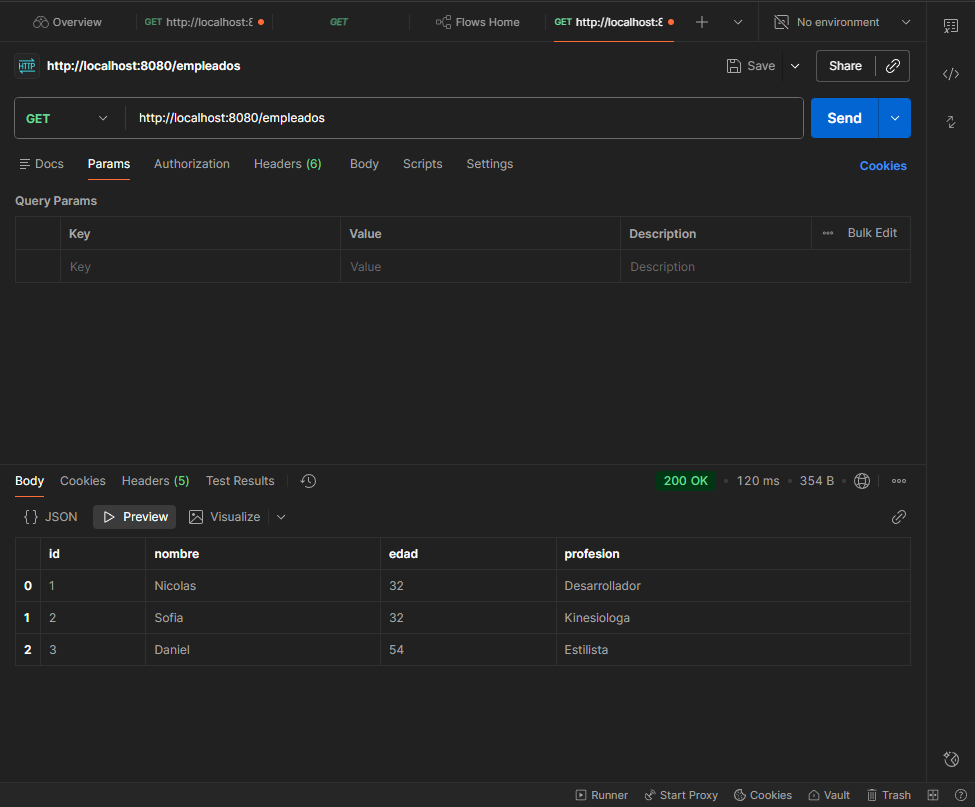
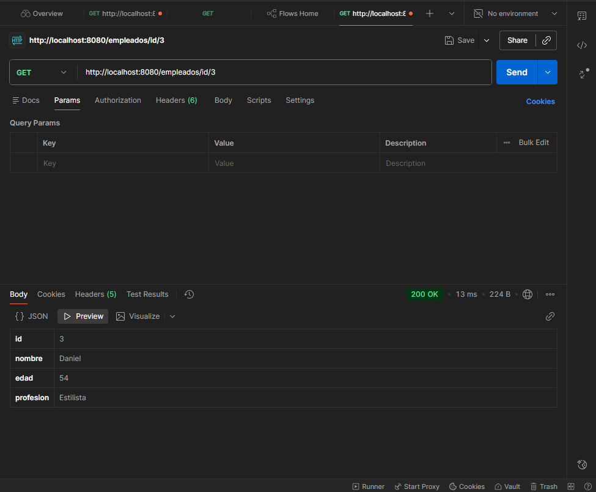
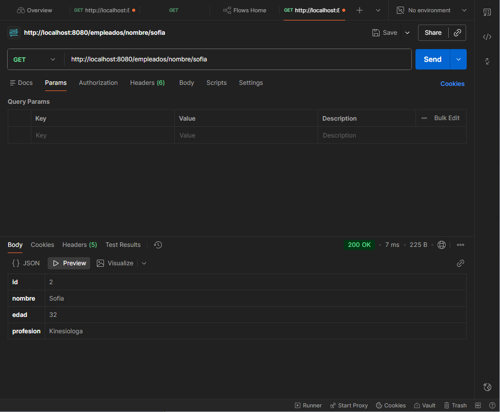
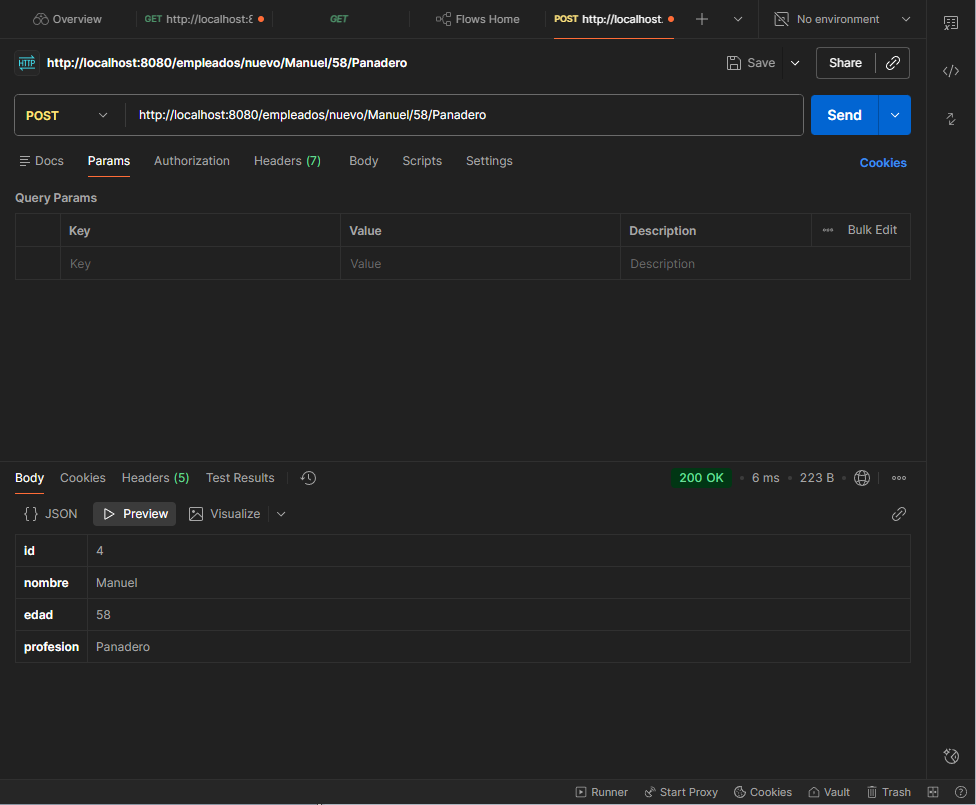
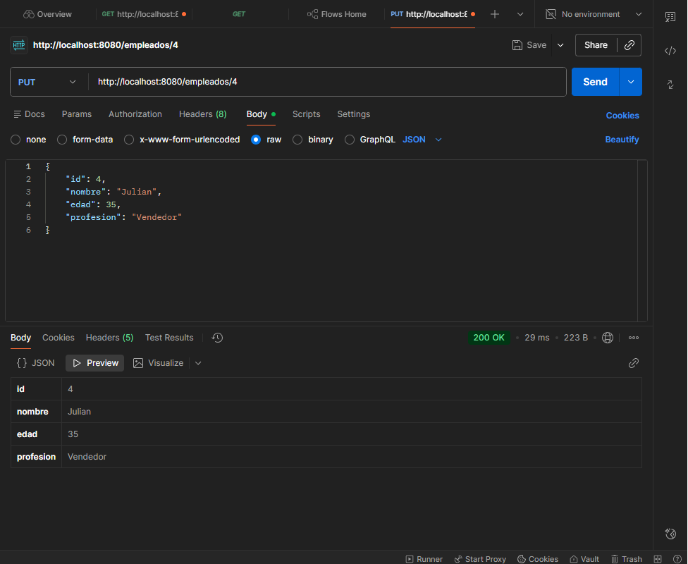
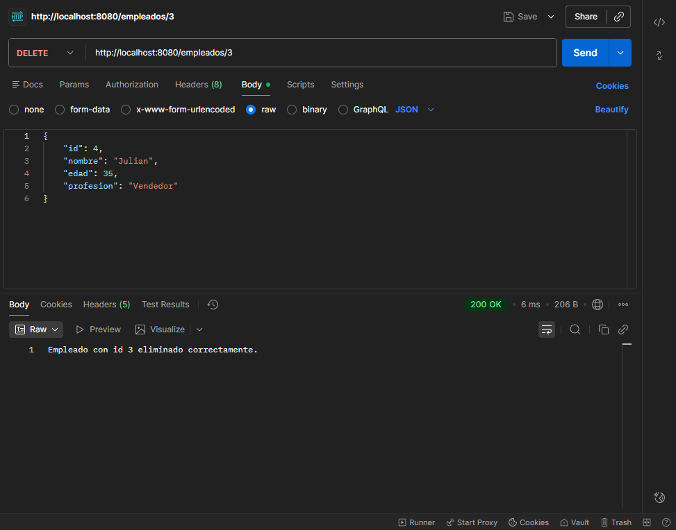
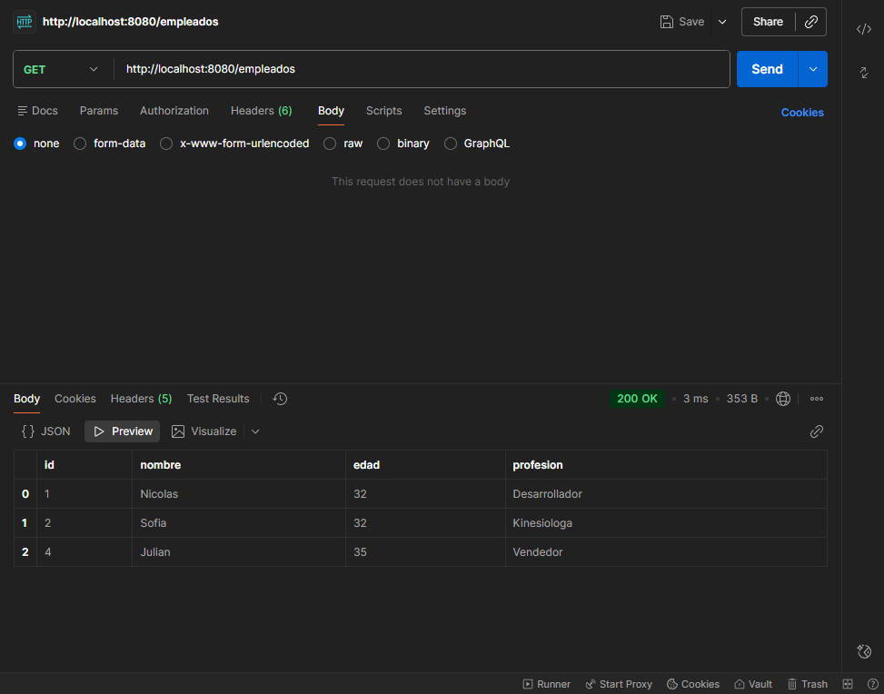

# API REST de Gestión de Empleados 

Desarrollé una API REST completa utilizando Java 17, Spring Boot y MySQL, enfocada en la gestión de empleados. El proyecto implementa las operaciones CRUD (crear, leer, actualizar y eliminar) aplicando buenas prácticas de diseño, y cuenta con una arquitectura real con base de datos, validaciones y despliegue mediante Docker.

## Características principales

- Arquitectura RESTful con endpoints bien estructurados.

- CRUD completo de empleados:

  - POST → creación de empleados
  
  - GET → listado y búsqueda por ID y por nombre
  
  - PUT → actualización parcial o total de un empleado
  
  - DELETE → eliminación por ID

- Manejo de datos utilizando una base de datos.

- Uso de Java Collections, Optional, Streams y expresiones lambda para búsquedas y manipulación de datos.

- Conversión automática de JSON ↔ objetos Java mediante @RequestBody.

- Manejo de rutas dinámicas con @PathVariable.

## Tecnologias utilizadas:

- Java 17

- Spring Boot (Spring Web)

- Hibernate/JPA para la persistencia

- MySQL como base de datos

- Docker para despliegue

- Maven

- IDE: IntelliJ IDEA

## Pruebas y validación:

### Realicé pruebas completas de la API utilizando Postman:

### GET – Obtener todos los empleados:

Método: GET

URL: /empleados

### GET – Obtener empleado por id:

Método: GET

URL: /empleados/id/{id}

### GET – Obtener empleado por nombre:

Método: GET

URL: /empleados/nombre/{nombre}

### POST – Crear un empleado:

Método: POST

URL: /empleados

### PUT – Actualizar empelado:

Método: PUT

URL: /empleados/{id}

### DELETE – Eliminar empelado con el id indicado:

Método: DELETE

URL: /empleados/{id}

Realizamos un GET para verificar lista luego del DELETE:

